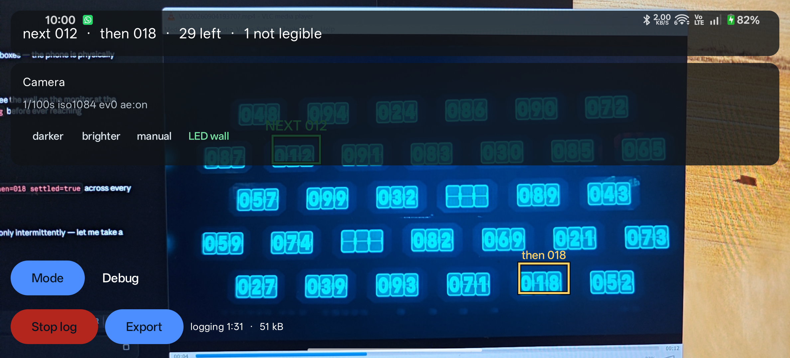
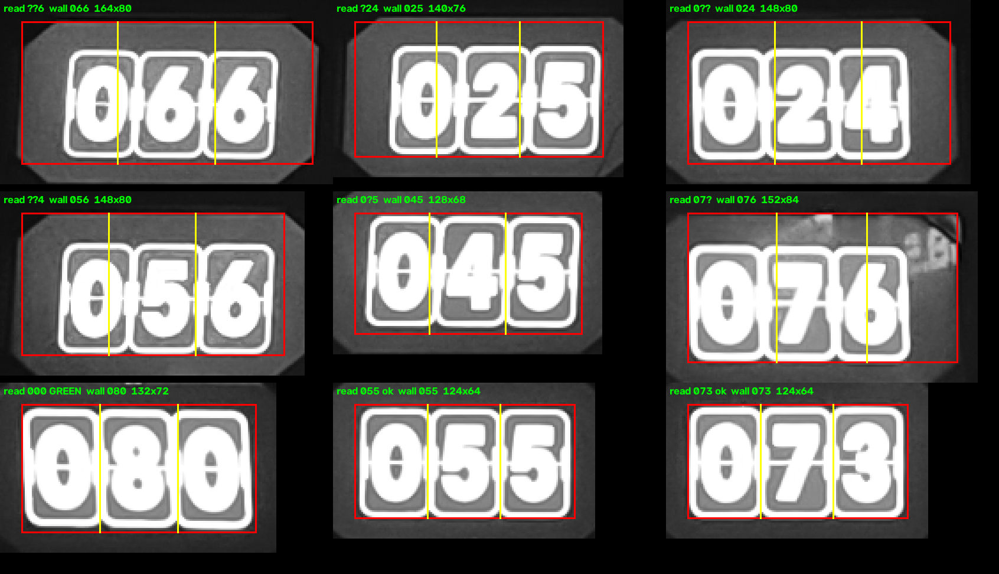

# The terminal puzzle

A dark wall of small lit panels, each a split-flap display showing a **three-digit
number**. A ball is fired at the wall and always takes the **lowest number showing**;
that display goes blank, and the round continues until nothing is left.

The app's whole job is to say which display is next. It outlines the lowest number on
screen in **green** and the second lowest in **yellow**, so the player knows where to
look now and where to look after that. The phone is held in landscape, which is the only
way the whole wall fits in frame.


*The reference frame with the reader's own output drawn on it: 32 displays found, all 93
legible digits read, 008 outlined green and 012 yellow. Reproduced by
`TerminalWallTest`.*

**Terminal does not use the AR pipeline.** Like [Gems](GEM_PUZZLE.md) it owns the camera
and reads each frame on its own, with no pose, no wall fit and no canvas. The reason is
different, though, and it is worth stating plainly.

## Why this mode has no canvas

Gems dropped the AR pipeline over exposure — ARCore would not pass a capture request
through to the sensor, so the gem rings were not in the image at all. None of that
applies here. These panels are bright, read from luma alone, and the reference clip was
shot on the phone's own auto-exposure with every digit legible.

Terminal drops it for a simpler reason: **the wall changes while you are reading it.**
The mosaic exists to combine looks at a wall taken at different moments into one image,
and that is only sound if the wall stood still. Here a display clears every few seconds,
so an accumulated canvas would hold numbers that were on the wall at different times —
and it would hold the *cleared* ones longest, because the last confident look at a
display is the one before it went blank. The single number the app has to produce is the
minimum over the wall right now, and a stale minimum is not a slightly worse answer, it
is the wrong rectangle on the wrong panel.

There is nothing worth accumulating, so nothing is accumulated. Each frame is read from
scratch at about ten hertz and the rectangles track the displays in the image.

## Finding the displays

The panels are **not on a lattice**. Rows hold six or seven of them, offset against each
other like brickwork, so there is no pitch to fit — neither `GridDetector` nor the gem
lattice detector has anything to lock onto, and every display has to be found on its own
evidence.

What makes that easy is a scale trick. At full resolution a display is a complicated
object: three tiles, each with a bright border, a seam across the middle, hinge nubs and
a digit. Decimate the frame to 480 pixels on its long side and all of that blurs into
one solid bright rectangle. So `DisplayDetector` decimates, subtracts a local
background, thresholds, takes connected components, and keeps the ones shaped like a
display:

| Test | Measured on the reference clip | Bound used |
| --- | --- | --- |
| aspect, width over height | 1.77–1.96 | 1.4–2.6 |
| fill, area over bounding box | 0.85–0.99 | ≥ 0.55 |
| area against the median | every display within ±10% | 0.45×–2.0× |

The background is *local* — a box blur about a twelfth of the frame — because the room
is lit by the wall itself, so a panel at the near end of a pan is several times brighter
than one at the far end and no single threshold finds both without also finding the glow
between them.

Decimating first is free: the detector finds all 32 displays unchanged from 1920×1080
down to 640×360. The digits are a different matter and are read at full resolution -- and
so, it turned out, is the box itself. The coarse pass can swallow the dark housing round a
display when the housing is lit, and a second pass at full resolution trims each box back
to the lit tiles. That was found in the room and is described under
[what the capture showed](#what-the-capture-actually-showed).

## Reading a digit

This is where the work is. Each tile is a rounded rectangle with a **bright border**, a
**seam** across the middle, a small **hinge nub** at each side, and a **bright digit**
drawn over all of it.

The problem is that the digit and the tile are the same brightness. Thresholding cannot
separate them. Neither can connected components: the digit *touches* the border and the
nubs — a zero is at its widest exactly where the nubs are.

### An opening separates them by thickness

Brightness is the wrong property to look at. The one that actually differs is
**thickness**: the border, seam and nubs are three or four pixels where a digit stroke is
a dozen. So the tile is resampled to a fixed 40×56 patch, thresholded with Otsu, and
opened by a seven-pixel disc. Erosion erases everything thin; dilation restores the
digit unharmed.

The disc size was chosen by measurement, not by taste — over 1860 legible digits from the
clip:

| Structuring element | Digits misread |
| --- | --- |
| 5-pixel disc | 5 — a nub survives attached to the glyph |
| **7-pixel disc** | **2** |
| 9-pixel disc | 8 — a nine's bowl erodes closed and reads as a zero |
| 7-pixel *square* | 8 |

Whatever survives the opening still detached — a nub that came away cleanly, a thick
corner of the border — is dropped by keeping only the largest component.

All of that assumes the digit and the border are not touching. On a wall shot bright
enough that the digits bloom, at mid-height they are, and the border has to be cut free
before the opening. That was found on the third visit and is described under
[the bloomed wall](#the-bloomed-wall).

### The opening is bitwise, or it would not fit in the budget

Eroding by a 7×7 disc the obvious way is 49 comparisons per pixel, which over 96 tiles a
frame is twenty million operations and tens of milliseconds — more than the whole scan
budget. The patch is 40 pixels wide, so a row of the mask fits in one `Long`, and erosion
by a disc becomes a handful of shifts and masks *per row* instead. Same answer, three
orders of magnitude less work. A full wall of 96 tiles reads in single-digit
milliseconds.

### A cleared display is not an empty one

A cleared tile still has a border and a seam, so something always survives the opening.
What it does not have is anything digit-shaped, and the two populations are nowhere near
each other:

| | digit | cleared |
| --- | --- | --- |
| largest blob, area of patch | 23–40% | 3–8% |
| largest blob, width of patch | 47–80% | 12–15% |

Each threshold sits in the middle of its gap. All three displays' tiles clear together,
so three blank tiles is a cleared display and is reported as such rather than as a
failure to read.

### Normalise by height, not by bounding box

The glyph is then scaled into a 28×28 patch for correlation, and *how* is the second
thing that had to be measured.

`CellReader` normalises by bounding box: crop to the ink, scale the long side to fill,
centre. That is right for a printed puzzle and wrong here. When a nub survives the
opening still joined to a zero, it widens the bounding box, the normalised glyph is
squeezed horizontally, and it correlates as a six. Measured over the clip, box
normalisation misreads 8 to 12 digits.

Every digit on this wall is drawn at one cap height, so **height is a ruler that does not
move**, and a centre of mass is barely shifted by a small blob stuck to one side. Scaling
by ink height and centring on the centroid misreads 2.

## The templates come from the wall

Everywhere else in this app, glyph templates are rendered at startup from the platform's
own font, and `GlyphAtlas` explains why: for a puzzle printed in an unknown typeface, a
template drawn by the same engine at the same resolution beats a shipped bitmap.

**That argument does not apply here, and following it anyway was measurably wrong.** The
wall's digits are a split-flap display in a fixed installation — the typeface is known
hardware, the same on every visit. And a generic sans-serif is a poor stand-in for it:

| Templates rendered from | Digits misread of 1860 |
| --- | --- |
| Helvetica-like bold (Arial) | 2 |
| Tahoma bold | 12 |
| Calibri bold | 14 |
| Segoe UI bold | 46 |
| Verdana bold | 60 |

Almost every Segoe failure is a three read as an eight, because that face draws a
flat-topped three and this wall draws a round one. Which face the platform happens to
supply is not something to leave to chance in a room with one attempt at a round, and
adding more families does not fix it — the wrong ones bring their own confusions.

So `terminal-digits.pgm` ships in `:core` and holds the wall's own digits: every legible
glyph in a set of labelled frames, normalised exactly as the reader normalises one,
averaged per digit. It holds three sets of ten, one from the reference clip and one from
each capture from the room, for the reason given under
[the bloomed wall](#the-bloomed-wall), and is 23 KB. `TerminalTemplateBuilder`
regenerates it by running the real reader, so the templates cannot drift from the
normalisation. It takes one directory per set, each holding frames and a `wall.txt` with
the wall as read by eye, and writes relative to the test's working directory, which is
`core/`:

```bash
./gradlew :core:test --tests '*TerminalTemplateBuilder*' \
    "-Dterminal.frames=clip;room-0917;room-0924" -Dterminal.out=src/main/resources
```

The separator is the platform's path separator, `;` on Windows and `:` elsewhere. Which
frames made each shipped set, and which are held out for the tests, is written in the
builder.

If your room's wall turns out to use a different display, that tool and a capture of it
are the whole of the fix.

Two other things follow from the templates being the wall's own:

- **The correlation floor is 0.70, not 0.55.** A real digit on the fixture scores 0.96 or
  more against these; 0.55 would not be a threshold, it would be an invitation for a
  smear of glare to be read as a seven.
- **The ambiguity margin is 0.03, not 0.06.** Ten digits at one size in one frame
  correlate highly with each other whatever they are — five against eight is 0.92 between
  the clip's templates and 0.95 between the room's — so genuine margins are narrow even
  when the answer is not in doubt. The narrowest correct margin over the fixture is
  0.053, an eight over a three. At 0.06 every one of those would be flagged ambiguous,
  which is not a safety net, it is a broken confidence number. A flagged digit is still
  read as its winner: refusing them was tried on the bloomed wall below and cost more
  than it saved.

Each glyph is matched one way up only, unlike the canvas modes, which try all four
quarter turns glyph by glyph. Here that could only make a reading worse — a six upside
down is a nine. Which way up the frame is still has to be decided, because the phone can
be held either way round, but that is decided once for the whole wall; see
[which way up](#which-way-up).

## The ranking is confirmed before it is drawn

Digit reading is right about 999 times in 1000. That sounds like enough and is not: with
32 displays in frame at ten scans a second, a once-in-a-thousand misread is a green
rectangle jumping to the wrong display every few seconds.

So `TerminalScanner` publishes a ranking only when **two consecutive scans agree** on it.
Until then the rectangles stay where they were and the HUD says the reading is not
settled. This costs a tenth of a second after the wall changes, and it is deliberately
confirmation rather than smoothing — a vote over a longer window would look steadier and
would also keep drawing a rectangle on a display that has already been hit.

## What it costs per frame

| Stage | Desktop JVM, 1280×720 fixture | CPH2655, 1920×1080 live |
| --- | --- | --- |
| detect: decimate, blur, threshold, components | ~2 ms | 9–18 ms |
| read: 96 tiles resampled, opened, normalised, matched | ~5 ms | 14–16 ms |
| **whole scan** | **~7 ms** | **24–33 ms** |

The device is four times slower, and it does not matter: scanning runs on the solver
thread at ~10 Hz against the newest camera frame, on the same handoff Gems uses. Newest
frame wins; a frame that arrives while one is being read is dropped rather than queued,
so a slow scan costs latency and never a backlog. A rectangle a tenth of a second late is
invisible to someone holding a phone.

The frame loop's own work measured 1–2.5 ms. The `fps` in the heartbeat is not the render
rate: it counts frames that carried a *new camera image*, so on device it reads 21 against
a render loop running at the display's rate. Gems on the same phone reads 10, so this is
the Camera2 path's delivery rate rather than anything either mode does.

That gap between the two rates had a consequence, and it is worth writing down because it
took a person looking at the phone to find it. The loop clears the colour buffer and then
draws the camera over it, and `nextFrame()` returns null on every tick where the sensor
has not delivered — which was two ticks in three. Those ticks returned early, after the
clear and before the draw, so they presented a **black frame**, and the preview flickered
badly. Sampling the screen put a number on it: 4 of 14 frames carried the camera before
the fix, 14 of 14 after. A viewfinder shows the last image until a new one arrives, so the
loop now redraws it. It cost one full-screen quad and one cached array of texture
coordinates.

The bug was in shared code, so **Gems had it too, and worse** — at 10 delivered frames a
second, five ticks in six were black.

## Verified on device

Run on a CPH2655 (Android 16, ARCore 1.54) against the reference clip played back on a
monitor, which exercises everything except the room's own light:



- All 32 displays found, every frame.
- `settled=true` with `next=012 then=018` on every heartbeat once the wall was in frame
  — the ranking never flickered.
- The rectangles land on the panels: green on 012 and yellow on 018, which are in fact
  the two lowest numbers left after 008 was hit.
- The shipped templates load from the APK, including through R8 and resource shrinking in
  a release build.
- One to three displays per frame report as not legible. That is the wall mid-flip plus
  one marginal panel, and it is reported rather than guessed at.
- The preview holds steady rather than flickering, which it did not before this run — see
  above.

Two things this does not cover: the room's own lighting, and a wall that is not a
recording of this one.

**Turn auto-rotate on.** The manifest is deliberately `fullUser`, so with rotation locked
the phone stays in portrait however it is held — and the preview, and the rectangles with
it, are drawn a quarter turn round. Nothing is wrong when that happens and the boxes are
still on the right displays, but a wall of numbers on its side is hard to read.

### Which way up

Landscape can be held either way round, and the camera's buffer is fixed to the phone, so
half the ways of holding it deliver the wall upside down. The preview turns with the phone
and looks right either way, which is what hid this. A monitor test held the other way
round read every display confidently and wrongly: `090` came out as `060` and took the
green rectangle, the whole wall ranked, nothing unread, nothing flagged. Turned over, the
same captured frames read perfectly.

The phone's own rotation is the obvious fix and the wrong one. With auto-rotate locked
it says portrait whichever way the phone is held, and that is a setting this doc already
tells people they can get away with. So `TerminalScanner` asks the wall. One digit's
orientation cannot be trusted, but a wall of them leaves no doubt. Over 204 frames — the
reference clip, both room captures, and the monitor test as shot and turned over —
reading the right way up gave a mean confidence of 0.87 to 0.99 across the lit displays,
bar one countdown frame caught mid-flip at 0.55. The wrong way up gave about 0.6. The
right way never lost. It won by 0.21 at the least, and by 0.11 on the mid-flip frame.

It reads both ways until it has seen a wall of at least six lit displays, and keeps
whichever read better. After that it reads the other way too on every tenth scan, and on
any scan whose mean falls below 0.85, which is what turning the phone over does. It turns
over when the other way wins by 0.1 twice running. While a turn is in doubt it draws no
rectangles, because a missing one for a tenth of a second is better than a wrong one.
Turning the phone over mid-round costs three scans, about a third of a second. `TerminalUpsideDownTest` turns
the fixtures over in code and checks all of this, and the heartbeat says which way it is
reading in `upside=`.

## What is on screen

- A **green** rectangle around the lowest number and a **yellow** one around the second
  lowest, drawn just outside the panel with a dark stroke underneath so they survive
  being drawn over a wall made of light. Each is labelled with the number itself, so a
  misread is visible rather than silent.
- **No status card.** Every other mode has one across the top of the screen, and this
  one used to: `next 008 · then 012 · 31 left`, or `19 numbers in view -- reading them`
  before the ranking settled. It went for the same reason as the camera card below. In
  landscape the top of the screen is the wall's top row, so the card sat over the
  displays it was pointing at, and all it said was already on the rectangles or was a
  count nobody acts on. The same line is still in the heartbeat, as `status='...'`.
- The camera dials, behind one button in the bottom-right corner, as on the other two
  self-lit walls. The gem wall's auto-exposure loop does not run here; this wall has its
  own, which meters the displays and keeps them exposed where the digits read best — see
  [metering the wall](#metering-the-wall). Tapping *darker* or *brighter* takes the
  exposure away from it, and *meter wall* gives it back.

  The card used to be on screen unprompted, which was the right call for the gem wall and
  the wrong one here: it is tall, and in landscape it covered the top two rows of displays,
  hiding the thing it exists to make readable. What earned it that place is kept on the
  button instead — it is labelled with the shutter the sensor actually delivered, live, and
  turns red saying `Camera !` when the sensor is ignoring what it was asked for. The card
  opens upward out of it.
- No Rescan, New wall, Record or Replay. There is no canvas to rescan and no tracked
  geometry to record, and the mode menu says `live camera -- no AR, no replay` next to
  the entry so that is not a surprise.

Logging starts by itself when the mode becomes active, as it does for Gems, and for the
same reason: there is one trip to the room.

## What a visit to the room found

The first real round, played rather than filmed, reported a quarter of the lit displays
found and unread - steadily, all evening. Working out why is the case for the capture
below, because the heartbeat's counts alone could not do it: they say *how many* failed
and never *which*, or how close they came.

What the counts did establish, over 157 heartbeats with the wall in frame:

| | |
| --- | --- |
| display-slots seen | 5183 |
| read as a number | 63% |
| lit but unreadable | 24% |
| correctly cleared | 13% |
| unread as a share of *lit* displays | **27%** |

- **Not cleared displays being miscounted.** `unread` held at 6.5-8 per frame from the
  start of a round to the end; only the share rose, because the denominator shrinks as
  displays clear. The blank test was right 683 times.
- **Not the extra blobs.** The detector returned 34 in 73 frames, 33 in 44 and 32 in 31,
  but mean `unread` across those was 7.9 / 7.2 / 8.2. Uncorrelated.
- **It cost the answer.** The published `next` went backwards four times inside a round -
  `011 to 010`, `010 to 004` twice, `026 to 024` - each one a display that was on the wall
  the whole time and only became readable later. That is a green rectangle on the wrong
  panel.

The cause came from replaying the reference clip, which is footage of the *same wall*, at
the same 1920x1080: 32 displays every frame, 1% unread, 99.5% of digits correlating above
0.9. So the reader was not at its limit. Degrading those frames one axis at a time found
which axis:

| | unread | digits rejected |
| --- | --- | --- |
| the clip as shot | 0.5% | 0.1% |
| sensor noise, sigma 16 | 0.4% | 0.1% |
| the wall at 0.6x the size | 0.6% | 0.2% |
| 9 px of motion blur | 2.5% | 1.0% |
| **13 px blur + 0.75x + noise** | **21.3%** | 7.4% |
| **15 px of diagonal motion blur** | **28.5%** | 10.3% |

The room measured 27%. Blur reproduced the number, so blur was called the cause, and
the shutter was pinned to freeze it (below). **That diagnosis was wrong**, and it is left
here because the way it was wrong is the lesson: a simulation that lands on the right
number is not evidence of the mechanism. The next visit brought back frames, and the
frames showed sharp digits.

### What the capture actually showed

The first burst `TerminalRecorder` brought back -- twelve frames, mid-round, from where a
player stands -- read 8 to 10 displays per frame as illegible, the same quarter as before.
The sidecar said which ones, and the pattern was in the box widths: displays that read
were 120-128 pixels wide, displays that did not were 140-176. The frame said why.



*The detector's box in red and its three tile cuts in yellow. Top row and left: boxes that
took in the dark octagonal housing round the tiles, and cuts that land mid-digit. Bottom
right: two that did not.*

Each display sits in a housing. The coarse detector works at a twelfth of the resolution
against a local background, and whether the housing clears that threshold depends on how
it is lit. On the reference clip, filmed from further back and squarer on, none did. From
where a player stands, the housings at the two ends of the wall face the camera and catch
enough light that eight of them did -- and a box a third too wide, cut into three equal
tiles, puts every cut through a digit. `066` read as `??6`; `076` as `07?` in all twelve
frames; and `080` as `000`, which being the lowest number on the wall took the green
rectangle. That last one is what the second visit reported as "another number missed".

**The fix is to tighten each box to the lit tiles at full resolution.** The tiles are the
brightest thing in the box by a wide margin -- borders and digits at the top of the range,
the housing near the bottom -- so `DisplayDetector.refine` cuts at 55% of the box's own
brightest content and trims to the columns and rows that carry a real run of it, thirty
per cent or more. Measured on that capture: the swallowed boxes come down from 148-164
wide to 121-122, which is what the clean ones were all along; on the clip, where nothing
was swallowed, boxes move by two or three pixels.

| | before | after |
| --- | --- | --- |
| captured round, 12 frames, unread as a share of lit | 27% | **2%** |
| the first five frames of it | 8 of 33 unread | **32 of 32 read** |
| the green rectangle | on `080` read as `000` | on `001` |
| reference clip, 64 frames | 1% | 0% |

What is left is honest: the score gauge on the side wall throwing a junk blob in three
frames of twelve, and two displays caught mid-flip as the ball takes them.

Two smaller things came out of the same frames. A lit rim at the left edge of the frame
returned as a 33rd display every time, so a blob touching the frame edge is now dropped --
it is either not a display or not one that can be read in full. And the trim's run floor
was first set at 15%, which let a lit reflection on one housing's corner hold a box open
by a single pixel per column; tile columns carry 85-95%, so it sits at 30% now.

### The shutter was still pinned, for a narrower reason

*This preset has since been replaced by [metering the wall](#metering-the-wall), which
keeps its shutter-first trade and drops the brightness it held. What it taught is kept
here.*

`CameraTuning.applyMotionFreezePreset` held the light where the camera's own metering put
it and bought a shorter exposure with gain: the opposite trade to the LED-wall preset, which
takes light away from a wall that was clipping. It was built to freeze the blur that
turned out not to be the problem, and it stays because the trade is still free -- this
reader is indifferent to noise and would be fatal to blur if it ever came -- but it is not
the fix for anything measured, and the doc no longer claims it is.

It did cause one problem on the captured round, and that *is* fixed. It fired the moment
the mode became active, which was a second before the wall came into frame, and so scaled
its gain from the floor of a dark room: 1/16 s at the sensor's ISO ceiling. There was no
headroom to trade, it settled for 1/97 s, and it locked that in -- so when the wall
arrived it ran two stops over-exposed for the whole round, every digit clipped to solid
white. It now waits until the reader has ten displays in frame, so the exposure it scales
from is the wall's, and when the gain ceiling cannot pay for the full 1/250 s it gives up
shutter rather than light. On the phone, applied with the wall in view, it asks for
`manual 1/250s iso2087` and the sensor honours it exactly.

## The bloomed wall

The third visit, on 24 September, came back with the complaint in the player's words: the
app was mixing up eights and zeros. The heartbeat agreed that something was badly wrong.
Over one round the published `next` went `003`, `000`, `009`, `003`, `009`, `000`, `008`,
`003`, `000`, `003`, `009`, and none of those was showing on the wall at the time. This
time there were 24 captured frames to say why: the 3-2-1 countdown that opens a round,
then twenty frames of the round itself.

The preset pinned `1/53s iso6400`, where the second visit's capture ran at `1/97s`, and
the frames averaged a luma of about 90 against 55. Every digit was clipped to white and
had bloomed, so the zero's counter was a slit and the eight's were two dots.

Labelled by eye, the round's twenty frames held 60 misread displays, and the green
rectangle was on the wrong display in 15 of them. The misreads were not scattered:

| read as | digits |
| --- | --- |
| five as zero | 38 |
| six as zero | 21 |
| nine as zero | 5 |
| eight as zero | 2 |
| three as eight | 2 |

In the countdown frame, 11 of the 32 threes read as an eight or a zero. In the round,
`058` came out as `008` in nearly every frame, `059` as `009`, `057` as `007` and `066`
as `006`. That is the dangerous direction. Every one of those is a real number read as a
lower one, and the lowest number is what gets the green rectangle. The same misread in
every frame also passes the two-scan confirmation, which only guards against a misread
that comes and goes. The confidence column in the sidecar gave it away: nearly every
misread came in at about 0.4, which is the classifier flagging a near-tie and the reader
using the winner anyway.

The masks showed the mechanism. A zero, five, six, eight or nine is widest at mid-height,
where the seam crosses the tile. At this exposure the last pixel or two of gap between the
digit and the tile's border fills in there, and the seam bridges the rest, so the
digit, the seam and the border make one shape too thick for the opening to take apart.
Every wide digit came out with the same pair of wings reaching both edges of the patch.
With the silhouette the same for all of them, the only thing left to tell them apart was
a counter a few pixels across.

**The fix is to cut the border free before the opening.** The column of bare tile face
just inside each border is bridged only for the rows around the seam, so it is still dark
on most rows. `DigitReader.severBorders` finds it from each edge inwards, as the first
column dark in at least half the rows, and clears it top to bottom. The border is then a
thin strip on its own, and the opening removes it as it always did. That alone took the
round from 60 misreads to 15, and the wrong green rectangle from 15 frames to 2. The
reference clip read exactly as before.

What was left was the templates. They had been averaged from the clip, where the counters
are open, so a bloomed zero now looked more like the clip's eight than its zero. The
shipped file now holds a set of ten from each of the three captures, and a glyph is
matched against all of them. Each set was tested on the capture it was not built from:
with the clip and the second visit as templates, the third visit's round misread 2
displays, where the clip's set alone misread 10 and one averaged set misread 6.

| | before | after |
| --- | --- | --- |
| the round's frames 25-36, held out of every template set: misread | 44 of 325 lit | **0** |
| the same frames: green rectangle on the wrong display | 12 of 12 | **0 of 12** |
| the same frames: left unread | 30 | 18 |
| the whole round, 20 frames: misread | 60 | 2 |
| the 3-2-1 countdown: misread | 9 of 32 | 1 |
| the second visit's capture: misread | 3 | 2 |
| reference clip, 96 frames | 0 | 0 |

The two misreads left in the round are a display caught mid-flip as the ball took it, and
a nine with glare across its foot. The second visit's two are both displays mid-flip.
`TerminalBloomTest` reads frame 25, the one that had put the green rectangle on `007`
where the lowest numbers on the wall were `028` and `029`.

Three things were tried and not kept:

- **Clipping the widest rows to the digit's width**, measured from the rows above and
  below. It removed the wings, but a four's crossbar reaches the edge of the tile too, and
  some fours came out as ones.
- **Cutting two columns instead of one.** The zero's narrow counter is what separates it
  from an eight, and the second column starts to eat the side of the digit around it: 80
  zeros read as eights over the round.
- **Refusing a digit the classifier flags as a near-tie.** One misread fewer, four times
  as many displays unread, and the green rectangle wrong *more* often, because the
  display left unread was as likely as any other to be the lowest.

What this did not fix is the exposure itself. The preset held the light where the
camera's metering put it, and metering a dark room with a bright wall in it will always
over-expose the wall. That is the next section.

## Metering the wall

The reader now reads through the bloom, but the better fix is not to bloom. The camera
meters the whole frame, which in this room is mostly dark, so it opens up until the room
is grey and the wall is well over. The reader is the one part of the app that knows where
the displays are, so it meters them itself.

**First, where to aim.** The reference clip reads perfectly and has none of its display
area at white; both captures from the room have half of it at white. Re-exposing the clip
in linear light and reading it again found how wide the readable range is:

| exposure against the clip | display area at white | misread | unread |
| --- | --- | --- | --- |
| 3 stops under | 0% | detection starts to fail | |
| 2 under to 2 over | 0–53% | 0 | 2 of 360, at 2 over |
| 2½ over | 58% | 11 | 84 of 360 |
| 3 over | 75% | 10 | 296 of 360 |

The clip sits in the middle, so its exposure is the target. The two captures from the room
meter at 1.1 and 1.8 stops over it. The re-exposed clip has no glare or halo in it, so the
real bright edge is nearer than two stops, which is where the 24 September misreads were.

**`DisplayMeter` measures it**, as part of every scan. For each lit display it takes the
brightest tenth, meaning the digits and borders, and the tile face at the 25th percentile.
It then takes the median of each across the wall. While the digits are under white, the
first says exactly how many stops off the wall is. Once they clip, it no longer says how far,
and the tile face, which stays on the scale for about three stops more, takes over.
Cleared displays are left out: a blank tile has less bright area, and counting it would
make a half-cleared wall look dark and pull the exposure back into the bloom by the end of
every round. Checked against re-exposed copies of the clip, it recovers a known shift to
within a quarter of a stop from two under to two and a half over. On the room frames it
reads the same value from one frame to the next to within a few hundredths.

**`TerminalExposure` acts on it**, from the solver thread, one reading per scan. On this
phone every change rebuilds the capture session and costs a few hundred milliseconds of
preview, so it corrects the whole error in one move and then checks, rather than stepping
a stop at a time. It moves only when all of these hold:

- the meter has seen at least ten lit displays, so walking up to the wall or pointing at
  the floor never moves it;
- three consecutive readings agree, taking their median;
- the wall is more than half a stop off, leaving a stop and a half to either edge;
- the sensor's metadata shows the last change has arrived, plus one straddling frame;
- two seconds have passed since the last change.

It does not settle and stop as the gem loop does. There is no mosaic to throw away here,
so a change costs only its gap in the preview. Its own caution keeps it still once it is
on target.

The light is paid for as the old preset paid for it: the shutter at 1/250 s to freeze a
hand-held pan, and gain for the rest. In this room the two agree. The 24 September wall
at 1/53 s and ISO 6400 would have gone to about 1/190 s at the same gain, darker and
sharper at once. Only a dim wall that has used up the gain lengthens the shutter, and not
past 1/60 s.

What can go wrong, and what it does:

| problem | response |
| --- | --- |
| a change loses the wall — no reading for three seconds after it arrives | put the old settings back, and go no further than half a stop short of the failed setting in that direction again |
| the phone's tone curve is steeper than the meter's 2.2 gamma, so a correction overshoots | halve the share of the error applied next time; a curve half again as steep still lands inside half a stop in a few moves |
| the sensor never shows what was asked for | stand down after three seconds and resume if it catches up, as the gem loop does |
| the user taps *darker* or *brighter* | the loop switches off; *meter wall* on the camera card switches it back on |

The heartbeat carries all of it in an `exp[...]` clause: the reading, the loop's state
and the last error it acted on. Every captured frame's sidecar records the reading taken
from that frame.

**On the phone, against the reference clip on a monitor:**

- **Brightness sweep with the camera left alone.** The phone's own metering is not
  fooled when a monitor fills the frame. It followed a full sweep of the monitor's
  brightness, ISO 1408 down to 276 and back, and the wall never metered more than 0.13
  stops off. The loop left it alone, which is right: it is there for a wall that is a
  patch of light in a dark room.
- **Recovery from four stops under.** *Darker* was tapped four times, to 1/4000 s, and
  detection fell to 13 to 17 displays of 32. *Meter wall* was then tapped. The loop moved
  three stops, its cap, landed 0.86 under, and two seconds later moved the rest, to
  1/250 s at ISO 3275 and 0.31 under. That is on target in four seconds with two changes.
- **Sweep with the loop in charge.** Brightening the monitor to 1.6 stops over, then
  dimming it to 1.2 under, took two changes each way, and each move was the measured
  error to within a hundredth of a stop. Every change was at least two seconds after the
  last, and the loop settled within 0.4 stops of target. The reader held 30 or 31 numbers
  throughout, with at most one unread, including at 1.6 stops over.

What it has not had is the room. The tests cover the meter on all three
real walls and the loop as a state machine. What only the room can show is whether the
phone's tone curve is close enough to the meter's for the loop to settle in one move
rather than two, and where the real bright edge sits.

## Getting evidence out of the room

`TerminalRecorder` is the counterpart of [`GemRecorder`](GEM_PUZZLE.md), and the visit
above is the argument for it: a quarter of the wall unread, and nothing came back but the
number. Reproducing that against an old clip and a simulated smear was a great deal of
work to arrive at a conclusion that pixels would have settled in a minute.

The **Capture** button arms a burst of twelve frames just under a second apart, or:

```bash
adb shell am broadcast -a com.puzzlesolver.app.DEBUG --ez termdump true --ei termframes 30 --ei termevery 300
```

Each frame is written as a gzipped **P5 PGM** - greyscale, because that *is* the reader's
input rather than a rendering of it, and PGM because `TerminalReplay` and
`TerminalWallTest` already load it. A wall that misread in the room becomes a failing unit
test on a desk, or a whole run replayed frame by frame, with nothing to convert:

```bash
adb pull /storage/emulated/0/Android/data/com.puzzlesolver.app/files/terminal ./capture
./gradlew :core:test --tests '*TerminalReplay*' -Dterminal.frames=./capture
```

Alongside them one growing sidecar carries a row per display - where it is, what came
back, and the confidence of the worst of its three digits. That last column is the one the
device log cannot carry and the one that separates the two failures it renders
identically: `0?4 conf=0.00` is a threshold question, `0-4` is a segmentation one.

## What is not covered

- **Replaying footage inside the app.** `VideoFrameSource` decodes straight to a
  `SurfaceTexture` for the GL background and never exposes the frame to the CPU, so the
  scanner cannot see it. Terminal needs no pose, so unlike the canvas modes there is no
  reason in principle it could not replay ordinary footage — it wants an `ImageReader` on
  the decoder's output, which is a real piece of work and is not done. Offline there is
  now `TerminalReplay`, which runs the real scanner over a directory of frames and prints
  what the heartbeat would have printed; that covers the diagnostic half of what an in-app
  replay would be for.
- **A second installation.** The shipped templates come from one clip and two captures,
  all of one wall. Everything else in the chain — detection, isolation, normalisation, ranking — is
  measured against real pixels, but the classifier has only ever seen this typeface.
- **Ties.** Two displays showing the same lowest number would get one green rectangle and
  one yellow. Nothing on the reference wall repeats a number and there is no evidence
  about what the game does if it happens.
- **Anything the ball does.** The app watches the wall; it does not model the shot, the
  timing, or where the ball is.
