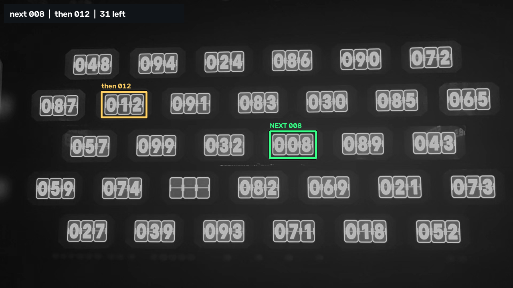

# The terminal puzzle

A dark wall of small lit panels, each a split-flap display showing a **three-digit
number**. A ball is fired at the wall and always takes the **lowest number showing**;
that display goes blank, and the round continues until nothing is left.

The app's whole job is to say which display is next. It outlines the lowest number on
screen in **green** and the second lowest in **yellow**, so the player knows where to
look now and where to look after that. The phone is held in landscape, which is the only
way the whole wall fits in frame.



*The reference frame with the reader's own output drawn on it: 32 displays found, all 93
legible digits read, 008 outlined green and 012 yellow. Reproduced by
`TerminalWallTest`.*

**Terminal does not use the AR pipeline.** Like [Gems](GEM_PUZZLE.md) it owns the camera
and reads each frame on its own, with no pose, no wall fit and no canvas. The reason is
different, though, and it is worth stating plainly.

## Why this mode has no canvas

Gems dropped the AR pipeline over exposure — ARCore would not pass a capture request
through to the sensor, so the gem rings were not in the image at all. None of that
applies here. These panels are bright, read from luma alone, and the reference clip was
shot on the phone's own auto-exposure with every digit legible.

Terminal drops it for a simpler reason: **the wall changes while you are reading it.**
The mosaic exists to combine looks at a wall taken at different moments into one image,
and that is only sound if the wall stood still. Here a display clears every few seconds,
so an accumulated canvas would hold numbers that were on the wall at different times —
and it would hold the *cleared* ones longest, because the last confident look at a
display is the one before it went blank. The single number the app has to produce is the
minimum over the wall right now, and a stale minimum is not a slightly worse answer, it
is the wrong rectangle on the wrong panel.

There is nothing worth accumulating, so nothing is accumulated. Each frame is read from
scratch at about ten hertz and the rectangles track the displays in the image.

## Finding the displays

The panels are **not on a lattice**. Rows hold six or seven of them, offset against each
other like brickwork, so there is no pitch to fit — neither `GridDetector` nor the gem
lattice detector has anything to lock onto, and every display has to be found on its own
evidence.

What makes that easy is a scale trick. At full resolution a display is a complicated
object: three tiles, each with a bright border, a seam across the middle, hinge nubs and
a digit. Decimate the frame to 480 pixels on its long side and all of that blurs into
one solid bright rectangle. So `DisplayDetector` decimates, subtracts a local
background, thresholds, takes connected components, and keeps the ones shaped like a
display:

| Test | Measured on the reference clip | Bound used |
| --- | --- | --- |
| aspect, width over height | 1.77–1.96 | 1.4–2.6 |
| fill, area over bounding box | 0.85–0.99 | ≥ 0.55 |
| area against the median | every display within ±10% | 0.45×–2.0× |

The background is *local* — a box blur about a twelfth of the frame — because the room
is lit by the wall itself, so a panel at the near end of a pan is several times brighter
than one at the far end and no single threshold finds both without also finding the glow
between them.

Decimating first is free: the detector finds all 32 displays unchanged from 1920×1080
down to 640×360. The digits are a different matter and are read at full resolution.

## Reading a digit

This is where the work is. Each tile is a rounded rectangle with a **bright border**, a
**seam** across the middle, a small **hinge nub** at each side, and a **bright digit**
drawn over all of it.

The problem is that the digit and the tile are the same brightness. Thresholding cannot
separate them. Neither can connected components: the digit *touches* the border and the
nubs — a zero is at its widest exactly where the nubs are.

### An opening separates them by thickness

Brightness is the wrong property to look at. The one that actually differs is
**thickness**: the border, seam and nubs are three or four pixels where a digit stroke is
a dozen. So the tile is resampled to a fixed 40×56 patch, thresholded with Otsu, and
opened by a seven-pixel disc. Erosion erases everything thin; dilation restores the
digit unharmed.

The disc size was chosen by measurement, not by taste — over 1860 legible digits from the
clip:

| Structuring element | Digits misread |
| --- | --- |
| 5-pixel disc | 5 — a nub survives attached to the glyph |
| **7-pixel disc** | **2** |
| 9-pixel disc | 8 — a nine's bowl erodes closed and reads as a zero |
| 7-pixel *square* | 8 |

Whatever survives the opening still detached — a nub that came away cleanly, a thick
corner of the border — is dropped by keeping only the largest component.

### The opening is bitwise, or it would not fit in the budget

Eroding by a 7×7 disc the obvious way is 49 comparisons per pixel, which over 96 tiles a
frame is twenty million operations and tens of milliseconds — more than the whole scan
budget. The patch is 40 pixels wide, so a row of the mask fits in one `Long`, and erosion
by a disc becomes a handful of shifts and masks *per row* instead. Same answer, three
orders of magnitude less work. A full wall of 96 tiles reads in single-digit
milliseconds.

### A cleared display is not an empty one

A cleared tile still has a border and a seam, so something always survives the opening.
What it does not have is anything digit-shaped, and the two populations are nowhere near
each other:

| | digit | cleared |
| --- | --- | --- |
| largest blob, area of patch | 23–40% | 3–8% |
| largest blob, width of patch | 47–80% | 12–15% |

Each threshold sits in the middle of its gap. All three displays' tiles clear together,
so three blank tiles is a cleared display and is reported as such rather than as a
failure to read.

### Normalise by height, not by bounding box

The glyph is then scaled into a 28×28 patch for correlation, and *how* is the second
thing that had to be measured.

`CellReader` normalises by bounding box: crop to the ink, scale the long side to fill,
centre. That is right for a printed puzzle and wrong here. When a nub survives the
opening still joined to a zero, it widens the bounding box, the normalised glyph is
squeezed horizontally, and it correlates as a six. Measured over the clip, box
normalisation misreads 8 to 12 digits.

Every digit on this wall is drawn at one cap height, so **height is a ruler that does not
move**, and a centre of mass is barely shifted by a small blob stuck to one side. Scaling
by ink height and centring on the centroid misreads 2.

## The templates come from the wall

Everywhere else in this app, glyph templates are rendered at startup from the platform's
own font, and `GlyphAtlas` explains why: for a puzzle printed in an unknown typeface, a
template drawn by the same engine at the same resolution beats a shipped bitmap.

**That argument does not apply here, and following it anyway was measurably wrong.** The
wall's digits are a split-flap display in a fixed installation — the typeface is known
hardware, the same on every visit. And a generic sans-serif is a poor stand-in for it:

| Templates rendered from | Digits misread of 1860 |
| --- | --- |
| Helvetica-like bold (Arial) | 2 |
| Tahoma bold | 12 |
| Calibri bold | 14 |
| Segoe UI bold | 46 |
| Verdana bold | 60 |

Almost every Segoe failure is a three read as an eight, because that face draws a
flat-topped three and this wall draws a round one. Which face the platform happens to
supply is not something to leave to chance in a room with one attempt at a round, and
adding more families does not fix it — the wrong ones bring their own confusions.

So `terminal-digits.pgm` ships in `:core` and holds the wall's own digits: every legible
glyph in the reference clip, normalised exactly as the reader normalises one, averaged
per digit. It is 7.9 KB. `TerminalTemplateBuilder` regenerates it by running the real
reader, so the templates cannot drift from the normalisation:

```bash
./gradlew :core:test --tests '*TerminalTemplateBuilder*' \
    -Dterminal.frames=/path/to/frames -Dterminal.out=core/src/main/resources
```

If your room's wall turns out to use a different display, that tool and a clip of it are
the whole of the fix.

Two other things follow from the templates being the wall's own:

- **The correlation floor is 0.70, not 0.55.** A real digit scores 0.93–0.98 against
  these; 0.55 would not be a threshold, it would be an invitation for a smear of glare to
  be read as a seven.
- **The ambiguity margin is 0.03, not 0.06.** Ten digits at one size in one frame
  correlate highly with each other whatever they are — five against eight is 0.92 between
  these templates — so genuine margins are narrow even when the answer is not in doubt.
  The narrowest correct margin over the fixture is 0.058, a zero over an eight. At 0.06
  every one of those would be flagged ambiguous, which is not a safety net, it is a
  broken confidence number.

Only one orientation is tried, unlike the canvas modes. The canvas is rectified only up
to a quarter turn; a camera frame's up is known exactly, and trying the other three
orientations there cannot make a reading better — a six upside down is a nine — only
worse.

## The ranking is confirmed before it is drawn

Digit reading is right about 999 times in 1000. That sounds like enough and is not: with
32 displays in frame at ten scans a second, a once-in-a-thousand misread is a green
rectangle jumping to the wrong display every few seconds.

So `TerminalScanner` publishes a ranking only when **two consecutive scans agree** on it.
Until then the rectangles stay where they were and the HUD says the reading is not
settled. This costs a tenth of a second after the wall changes, and it is deliberately
confirmation rather than smoothing — a vote over a longer window would look steadier and
would also keep drawing a rectangle on a display that has already been hit.

## What it costs per frame

Measured on the 1280×720 fixture on a desktop JVM; the device figures will be larger, but
the shape of them is what matters:

| Stage | Time |
| --- | --- |
| detect: decimate, blur, threshold, components | ~2 ms |
| read: 96 tiles resampled, opened, normalised, matched | ~5–18 ms |

Scanning runs on the solver thread at ~10 Hz against the newest camera frame, on the same
handoff Gems uses: newest frame wins, a frame that arrives while one is being read is
dropped rather than queued. A rectangle a tenth of a second late is invisible to someone
holding a phone; a rectangle four frames stale is not.

## What is on screen

- A **green** rectangle around the lowest number and a **yellow** one around the second
  lowest, drawn just outside the panel with a dark stroke underneath so they survive
  being drawn over a wall made of light. Each is labelled with the number itself, so a
  misread is visible rather than silent.
- A status line: `next 008 · then 012 · 31 left`, or `19 numbers in view -- reading them`
  before the first ranking settles.
- The camera dials, unprompted, as on the other two self-lit walls. Nothing moves them by
  itself here — the auto-exposure loop closes on how much *colour* survived, which is the
  gem wall's problem and not this one — but a user who does find the wall blown out should
  have the dial in front of them rather than behind a debug toggle.
- No Rescan, New wall, Record or Replay. There is no canvas to rescan and no tracked
  geometry to record, and the mode menu says `live camera -- no AR, no replay` next to
  the entry so that is not a surprise.

Logging starts by itself when the mode becomes active, as it does for Gems, and for the
same reason: there is one trip to the room.

## What is not covered

- **Replaying the reference clip through the app.** `VideoFrameSource` decodes straight
  to a `SurfaceTexture` for the GL background and never exposes the frame to the CPU, so
  the scanner cannot see it. Terminal needs no pose, so unlike the canvas modes there is
  no reason in principle it could not replay ordinary footage — it wants an
  `ImageReader` on the decoder's output, which is a real piece of work and is not done.
  The off-device path today is `TerminalWallTest` against a still frame.
- **A second installation.** The shipped templates are averaged from one clip of one
  wall. Everything else in the chain — detection, isolation, normalisation, ranking — is
  measured against real pixels, but the classifier has only ever seen this typeface.
- **Ties.** Two displays showing the same lowest number would get one green rectangle and
  one yellow. Nothing on the reference wall repeats a number and there is no evidence
  about what the game does if it happens.
- **Anything the ball does.** The app watches the wall; it does not model the shot, the
  timing, or where the ball is.
